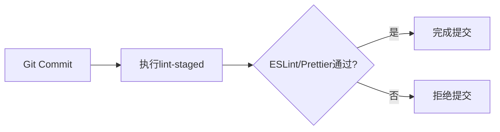
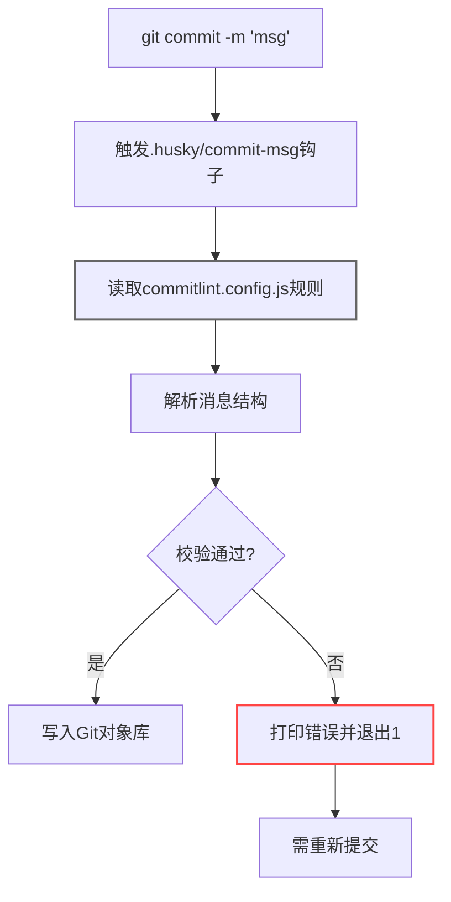
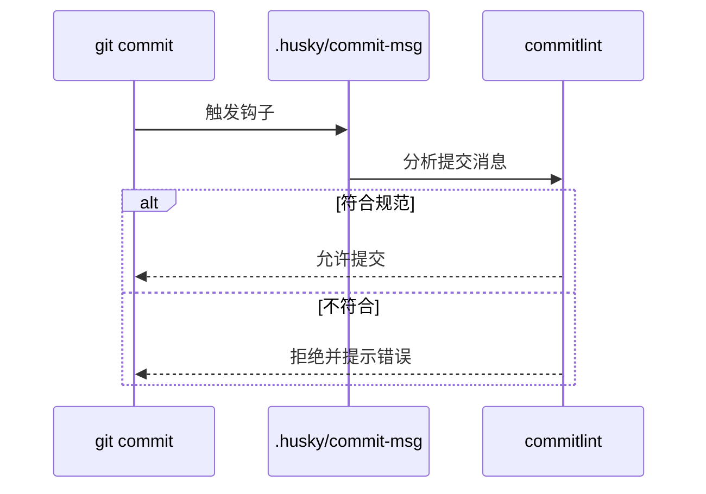

# Week 02 (Jun. 29-Jul. 06, 2025)

## 项目进度

### 已完成

- [x] 优化`eslint.config.js`的代码分类，根据功能分类不同的规则，并且保留prettier相关规则的代码，目的是error时出现红色波浪线
- [x] 引入`prettier.config.js`，负责处理代码格式化，在保存代码时自动修复代码风格，同一风格（例：缩进 2 空格、单引号、尾随逗号）
- [x] 引入`commitlint.config.js`,负责处理commit消息校验，在提交时校验commit消息格式是否规范

### 进行中

#### 1. commitlint 配置规范

- 当前进度：70%
- 阻塞问题：
  - 目前校验规则比较少，需要增加配置
  - 存在废弃的规则，在官方文档查阅修改

## 学习记录

### Husky 工程化实践

`#Git工具链` `#前端工程化` `2025-07-06`

#### 核心优势

- **简化 Git 钩子管理：** 传统 Git 钩子需要手动编写脚本并放置在`.git/hooks`目录，Husky通过命名行工具自动生成和管理钩子文件，大幅降低配置复杂度。
- **统一团队开发流程：** 将钩子配置纳入版本控制，确保团队成员使用相同的代码检查、测试流程，减少因环境差异导致的问题。
- **灵活集成第三方工具：** 可与 ESLint、Prettier、Jest 等工具无缝结合，在提交或推送前自动执行代码检查、格式化、测试等操作，保障代码质量。
- **跨平台兼容：** 支持 Windows、macOS、Linux 系统，通过内置脚本适配机制，解决不同系统下 Shell 脚本执行差异问题。

#### husky 功能流程

1. **提交前检查（pre-commit）**



2.**提交信息校验（commit-msg）**
   在`commitlint.config.js`配置校验信息，在提交代码到远程仓库时进行规范化



3.**推送前检查（pre-push）**

#### 配置流程

完整的安装流程

```bash
# 安装 husky & lint-staged
npm install husky lint-staged --save-dev

# 启动 Git 钩子
npx husky install
```

配置样式

```json
// package.json
// 在 package.json 中配置 lint-staged
// 工具 lint-staged 只对本次提交的代码进行检查和格式化
{
  "lint-staged": {
    "*.{js,jsx,ts,tsx}": ["eslint --fix", "prettier --write"],
    "*.{json,md}": ["prettier --write"]
  }
}
```

### commitlint 规范化提交实践

`#Git工具链` `#工程规范` `2025-07-06` `适合版本：@commitlint/cli 19.x+ @commitlint/config-conventional 19.x+`

#### 核心价值

| 传统问题           | commitlint解决办法                  | 量化收益                   |
| ------------------ | ----------------------------------- | -------------------------- |
| 提交信息杂乱无章   | 强制遵循 Conventional Commits       | 日志可读性提升70%+         |
| 难以生成CHANGELOG  | 标准化分类（type）与作用域（scope） | 自动化文档生成节省2h/周    |
| 不规范的版本号变更 | commitlint 规范 type 与 scope       | 版本变更更规范，发布更及时 |

#### 技术实现

流程图



配置流程

```bash
# 安装依赖
npm install --save-dev @commitlint/cli @commitlint/config-conventional

# 创建 commitlint.config.js
touch commitlint.config.js

# 配置 Husky 钩子
npx husky add .husky/commit-msg 'npx --no-install commitlint --edit "$1"'

# 测试提交消息是否符合规范
echo "fix: 修复登录验证问题" | npx commitlint
```

提交信息解剖

```text
类型(作用域 # 可选): 主题  # 必填

正文  # 详细说明（可选）

页脚  # 关联ISSUE或BREAKING CHANGE（可选）
```

正例：

```bash
git commit -m "feat(auth): add OAuth2 support

- Implement Google OAuth2 provider
- Add token refresh mechanism

Refs: JIRA-1234"
```

## 下周计划

1. 搭建 CI/CD 流水线
2. 完善 commitlint 规范与 husky 配置
3. 搭建 vscode 中 Linux 内置终端环境

## 问题与思考

如何更好地集成 Git 工具链与 CI/CD 流程？
