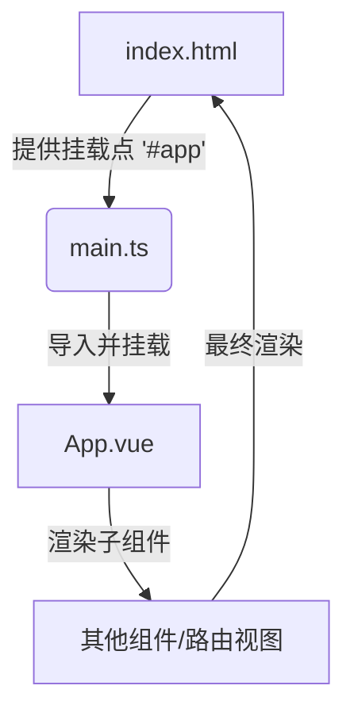

# Week 03 (Jul. 07-13, 2025)

## 项目进度

### 已完成

- [x] 完善 commitlint 规范和 husky 配置

### 进行中

#### 1.stylelint 规则问题

- 当前进度：50%
- 阻塞问题：
  - 文档注释规则不正确，在stylelint只找到针对css规范的注释，存在废弃规则

  ```js
  // 废弃规则
  'scss/comment-no-loud';
  ```

- ## 解决办法

## 学习记录

### App.vue 根组件工程化

`Vue 组件` `前端开发` `2025-07-08`

- 核心特性
  - 应用入口组件：作为 Vue 应用的根组件，承载整个应用的布局结构和核心逻辑，所有页面组件都通过它进行渲染和管理，连接路由、状态管理与视图的枢纽。
  - 单文件组件结构：采用单文件格式，分别负责视图模块，业务逻辑和样式定义，实现前端三件套的模块化开发。
  - 全局配置载体：可集中配置全局样式（如引入CSS重置文件、主题变量）、注册全局组件（如按钮、表单组件）、定义全局指令（如权限控制指令），简化组件服用和样式统一。
  - 生命周期关键节点：其生命周期钩子（如`created`、`mounted`）常用于执行应用初始化操作，例如全局状态初始化、路由守卫注册、接口拦截请求器配置等，确保应用启动时的环境准备。
- 与其他组件的关联
  - 作为根组件，它是所有页面组件的父级，子组件通过`$parent`可访问其属性和方法，但更推荐使用props和事件进行通信，或通过状态管理工具实现跨组件数据交互。
  - 与`main.ts`(入口文件) 紧密配合：`main.ts`通过`createApp(App).mount('#app')`将App.vue挂载到DOM节点，完成应用的启动流程，二者共同构成Vue应用的基础架构。

### 构建应用核心文件

`Vue 入口文件` `#前端初始化` `2025-07-09`

- 核心文件：`App.vue`、`main.ts`、`index.html`、`router/index.ts`
- 功能职责：
  - `App.vue`：应用根组件，定义全局布局、注册路由、状态管理等，协调页面组件的渲染与交互。<br/>
    **流程角色：**<br/>
    - 作为组件树的根节点，管理全局布局（如页眉、页脚）。
    - 通过 `<router-view>` 动态渲染路由匹配的组件

    ```vue
    <template>
      <div>
        <Header />
        <!-- 子组件 -->
        <router-view />
        <!-- 路由渲染的组件 -->
        <Footer />
        <!-- 子组件 -->
      </div>
    </template>

    <script>
    export default {
      name: 'App', // 根组件逻辑
    };
    </script>
    ```

  - `main.ts`：应用入口，初始化 Vue 实例、挂载根组件、配置全局状态管理、注册全局组件等，完成应用的启动与运行。<br/>
    **流程角色：**<br/>
    - 从 App.vue 导入根组件。
    - 将根组件挂载到 index.html 的 #app 节点。

    ```typescript
    import { createApp } from 'vue';
    import App from './App.vue'; // 导入根组件

    const app = createApp(App); // 创建 Vue 实例
    app.mount('#app'); // 挂载到 index.html 的 #app 节点
    ```

  - `index.html`: 应用的HTML模板文件，定义了页面的结构、引入外部资源（如CSS、JS文件），是整个应用的基础骨架，Vue 应用的静态入口。<br/>
    **流程角色：**
    - 提供一个 DOM 节点（#app）作为 Vue 的渲染目标。
    - 提供Web应用的基础HTML骨架
    - 承载全局性meta标签和基础资源引入

    ```html
    <body>
      <div id="app">
        <!-- Vue 应用挂载点，所有组件都会渲染到这里 -->
      </div>
    </body>
    ```

**流程图：**



## 下周计划

1. 搭建 CI/CD 流水线
2. 搭建 vscode 中 Linux 内置终端环境
3. 搭建管理端框架结构

## 问题与思考
