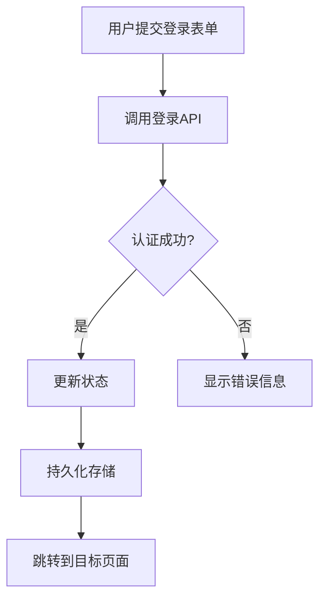

# Week 05 (Aug. 18-24, 2025)

## 项目进度

### 已完成

- [x] 完成用户认证系统(store/user.ts)的真实登录逻辑实现
- [x] 修改Login.vue组件，更新登录处理逻辑
- [x] 修改Register.vue组件，注册成功后自动登录用户
- [x] 优化用户注册流程，提升用户体验

### 进行中

#### 1. 用户认证系统完善

- 当前进度：80%
- 阻塞问题：
  - 需要进一步测试各种边界情况
  - 需要完善错误处理机制

## 学习记录

### 用户认证系统实现

`#Vue3` `#Pinia` `#用户认证` `#前端安全` `2025-08-24`

#### 核心实现

用户认证系统是现代Web应用的核心功能之一，负责管理用户身份验证和会话状态。

- **状态管理**：使用Pinia作为状态管理库，统一管理用户认证状态
- **Token存储**：使用localStorage持久化存储JWT Token
- **路由守卫**：实现路由级别的权限控制
- **API集成**：与后端认证API无缝集成

#### 技术实现细节

1. **Store设计**

用户状态管理使用Pinia实现，包含以下核心状态：

- `user`: 当前用户信息
- `token`: JWT认证令牌
- `isAuthenticated`: 认证状态标识

```typescript
interface AuthState {
  user: User | null;
  token: string | null;
  isAuthenticated: boolean;
}
```

2. **登录流程**

登录流程包括以下步骤：

- 调用后端登录API
- 验证响应数据
- 更新状态管理
- 持久化存储
- 路由跳转



3. **安全性考虑**

- Token过期处理
- XSS防护
- CSRF防护
- 密码安全传输

#### 代码实现示例

**Store核心逻辑**

```typescript
// 登录方法实现
async login(credentials: { username: string; password: string }) {
  try {
    // 调用实际的登录API
    const response = await getLogin({
      username: credentials.username,
      password: credentials.password
    });

    if (response.code === 200 && response.data) {
      const { token, user } = response.data;

      // 保存到状态
      this.user = user;
      this.token = token;
      this.isAuthenticated = true;

      // 保存到本地存储
      localStorage.setItem('token', token);
      localStorage.setItem('user', JSON.stringify(user));

      return { success: true };
    } else {
      return { success: false, error: response.message || '登录失败' };
    }
  } catch (error: any) {
    console.error('登录失败:', error);
    return { success: false, error: error.message || '登录异常' };
  }
}
```

**组件集成**

```vue
<script setup lang="ts">
const handleSubmit = async (data: any) => {
  // 获取用户store实例
  const userStore = useUserStore();

  // 调用登录方法
  const result = await userStore.login({ username: data.username, password: data.password });

  if (result.success) {
    ElMessage.success('登录成功');
    // 跳转到目标页面
  } else {
    ElMessage.error(result.error || '登录失败');
  }
};
</script>
```

### 刷新页面不存在

## 下周计划

1. 完善用户认证系统的边界情况处理
2. 实现用户权限管理系统
3. 添加用户信息编辑功能
4. 优化登录/注册页面UI/UX

## 问题与思考

如何更好地处理JWT Token的刷新机制？
如何实现更安全的用户会话管理？